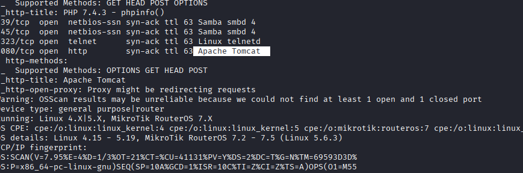
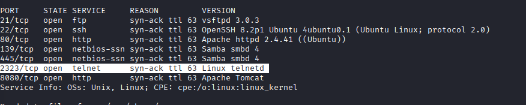
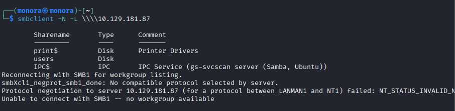
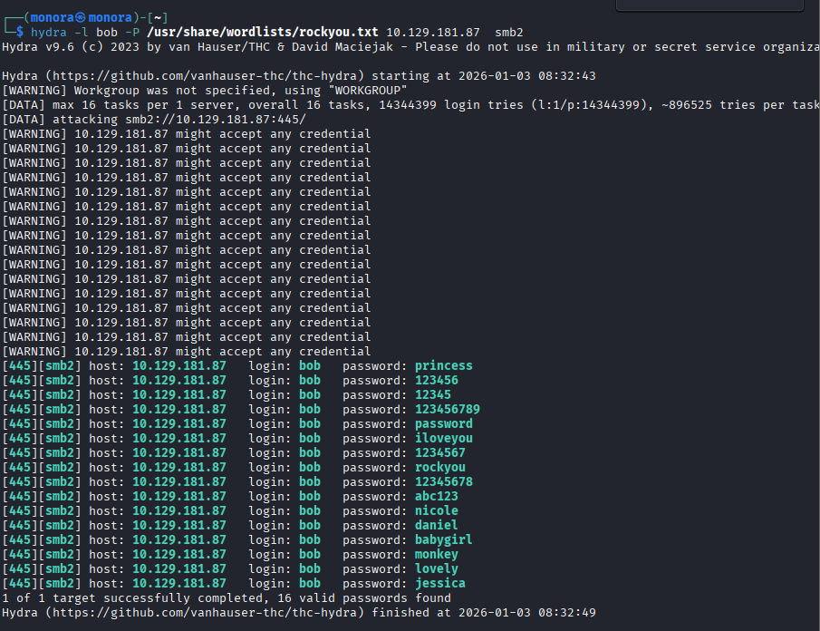
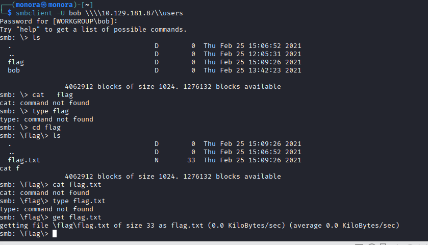
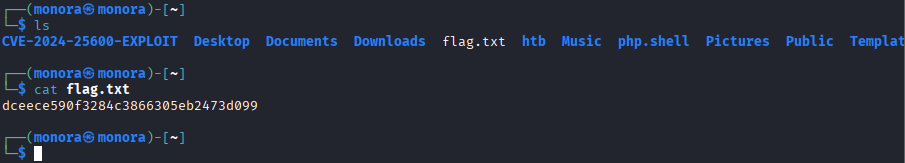

# htb-writeup
# I just want to document what I have learn from htb academy.
# Module: Get started 
# Section: Service scanning

Lab

Perform an Nmap scan of the target. What does Nmap display as the version of the service running on port 8080?

Answer: Apache Tomcat

Since nmap is really slow  i just used RustScan instead because the features are almost the same but it is faster. i run 

./rustscan -a 10.129.181.87 -- -sC -sV -A

-A for Specifies the target IP 

-- Instructs RustScan to pass all following arguments directly to Nmap

-sC for script scanning

-sV  for version scanning 

-A for Aggressive Scan

 Perform an Nmap scan of the target and identify the non-default port that the telnet service is running on.

answer: 2323

from the previous scan:

1. List the SMB shares available on the target host. Connect to the available share as the Bob user. Once connected, access the folder called 'flag' and submit the contents of the flag.txt file.

answer: dceece590f3284c3866305eb2473d099

first i enumeration smb share folder using the command 

smbclient -N -L \\\\10.129.181.87. Then we need to access the share folder using bob credential, but i forgot to read in the lesson, so i didnit see the password. And I try to brute-force using hydra eventhogh bob has many passwords that match, but it still does not work. Only the password provided was working

so i ran smbclient -U "bob" \\\\10.129.181.87\\users
with pass: Welcome1 i can access and get the flag

